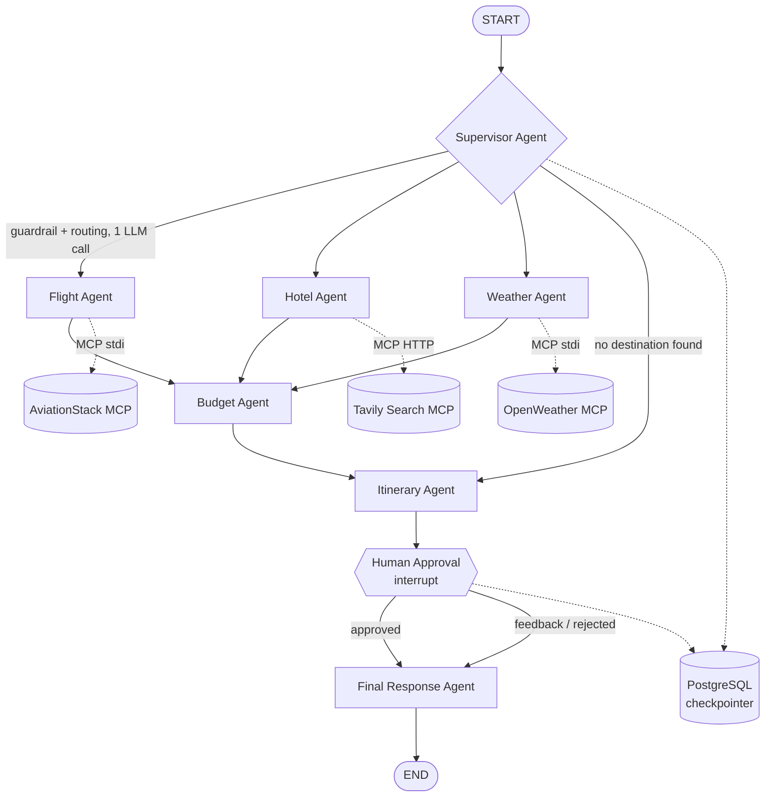

# 🧭 Stateful Multi-Agent Travel Planner

A multi-agent travel planning system built on **LangGraph**. A supervisor agent parses free-text travel requests, routes them to specialist agents (flights, hotels, weather, budget), pulls live data through **MCP (Model Context Protocol)** tool servers, and produces a draft itinerary that pauses for **human-in-the-loop approval** before finalizing — with conversation state persisted in **PostgreSQL** so sessions survive restarts.

---

## Table of Contents

- [Overview](#overview)
- [Architecture](#architecture)
- [Request Lifecycle](#request-lifecycle)
- [Tech Stack](#tech-stack)
- [Project Structure](#project-structure)
- [Getting Started](#getting-started)
  - [Local Setup](#local-setup)
  - [Docker Setup](#docker-setup)
  - [Kubernetes Deployment](#kubernetes-deployment)
- [Environment Variables](#environment-variables)
- [State Schema](#state-schema)
- [Testing](#testing)
- [Security](#security)
- [Production Readiness](#production-readiness)
- [Roadmap](#roadmap)
- [Contributing](#contributing)
- [License](#license)

---

## Overview

Most "AI travel planner" demos are a single prompt wrapped in a chat UI. This project is structured closer to how a real agentic system is built:

- **Supervisor / specialist pattern** — a routing agent decides *which* specialists a request actually needs, instead of always running the full pipeline.
- **Tool use via MCP** — flight, weather, and search data come from real MCP tool servers (two local `stdio` servers, one hosted over HTTP), not hallucinated by the LLM.
- **Durable state** — every run is checkpointed to Postgres via LangGraph's `PostgresSaver`, keyed by a `thread_id`, so a user can resume a conversation (including a pending approval) after a page refresh or container restart.
- **A real human-in-the-loop step** — the graph actually `interrupt()`s and waits for a human decision before producing the final plan, rather than simulating approval with a UI toggle that doesn't affect execution.
- **Defensive LLM-JSON handling** — the supervisor's structured output is parsed defensively with a retry loop, so a malformed JSON reply degrades gracefully instead of crashing the whole graph run.

## Architecture



Only the agents the supervisor actually selects run — the graph is compiled with conditional edges (`route_from_supervisor`, `route_after_agent`) that skip straight past any specialist not in `selected_agents`, so a request like *"is Bali expensive in July?"* doesn't necessarily trigger a flight search.

## Request Lifecycle

1. **User submits a query** in the Streamlit UI (`frontend.py`), which invokes the compiled LangGraph `app` with a `thread_id` tied to the browser session.
2. **`supervisor_agent`** makes a single LLM call that does double duty: it acts as an input guardrail (rejecting non-travel requests) *and* extracts structured trip constraints (destination, budget, dates, preferences) plus the list of specialist agents to run. This was deliberately merged from two calls into one to cut latency and cost.
3. **Specialist agents run** in a fixed order (`flight → hotel → weather → budget`), but only for agents the supervisor selected:
   - `flight_agent` calls the AviationStack MCP server (`list_airports`, `list_airlines`) concurrently via `asyncio.gather`, then asks the LLM to turn raw airport/airline data into booking guidance.
   - `hotel_agent` calls Tavily search (hosted MCP over HTTP) directly — no LLM call, since Tavily's summarized web results are used as-is.
   - `weather_agent` calls the local OpenWeather MCP server (`get_current_weather`, `get_forecast`) concurrently, again with no LLM call.
   - `budget_agent` synthesizes flight/hotel/weather output with an LLM call into a feasibility assessment.
   - Both `flight_agent` and `weather_agent` fail safe: if the supervisor didn't extract a destination, they skip their MCP/LLM calls entirely and return an explanatory message instead of raising `KeyError`.
4. **`itinerary_agent`** consolidates everything into a structured draft and prepares an approval prompt.
5. **`human_approval_agent`** calls `interrupt()`, which pauses the graph and surfaces the draft itinerary back to Streamlit. Execution genuinely halts here — LangGraph persists the paused state to Postgres and returns `__interrupt__` in the result. The user can approve or submit revision feedback in the sidebar; the frontend resumes the graph with `Command(resume=...)`.
6. **`final_response_agent`** produces the polished plan — incorporating human feedback if the draft was rejected — and the graph ends.

Every prompt that embeds upstream results (itinerary drafts, MCP tool output, budget notes) passes through a character-limit guard (`_truncate`) so a long web-search result or itinerary can't silently blow the model's context window.

## Tech Stack

### Language & Runtime

| Component | Version |
|---|---|
| Python | 3.13 (`python:3.13-slim` base image) |
| Package manager | `pip` (`uv` also present in `requirements.txt` for optional faster installs) |

### Agent Orchestration & LLM

| Framework | Version | Role |
|---|---|---|
| [LangGraph](https://github.com/langchain-ai/langgraph) | `1.2.0` | `StateGraph` construction, conditional edges, `interrupt()`-based human-in-the-loop |
| `langgraph-checkpoint` / `langgraph-checkpoint-postgres` | `4.1.0` / `3.1.0` | Postgres-backed checkpointing (`PostgresSaver`) for durable, resumable graph runs |
| `langgraph-prebuilt` / `langgraph-sdk` | `1.1.0` / `0.3.14` | Supporting LangGraph runtime utilities |
| [LangChain](https://github.com/langchain-ai/langchain) core | `1.4.0` (`langchain` `1.3.1`) | Message types (`HumanMessage`, `AIMessage`, `SystemMessage`), core abstractions |
| `langchain-groq` | `1.1.2` | Groq LLM chat model integration |
| `langchain-mcp-adapters` | `0.2.2` | Bridges LangChain/LangGraph tool-calling with MCP servers |
| `langchain-tavily` | `0.2.18` | Tavily search integration |
| Groq API (`groq` SDK `0.37.1`) | — | LLM inference — `llama-3.3-70b-versatile` by default (configurable via `GROQ_MODEL`) |

### Tool Access — Model Context Protocol (MCP)

| Component | Version | Transport | Role |
|---|---|---|---|
| `mcp` (official Python SDK, incl. `FastMCP`) | `1.27.2` | — | Framework used to build `weather_mcp_server.py` |
| Weather MCP server | local | `stdio` subprocess | Wraps the OpenWeather REST API as MCP tools (`get_current_weather`, `get_forecast`) |
| AviationStack MCP server | local (`./aviationstack-mcp`, separate package) | `stdio` subprocess | Wraps AviationStack as MCP tools (`list_airports`, `list_airlines`) |
| Tavily MCP | hosted | `streamable_http` | Web search, used directly by `hotel_agent` |

### Data & Persistence

| Component | Version |
|---|---|
| PostgreSQL | `16-alpine` (Docker image) |
| `psycopg` / `psycopg-binary` / `psycopg-pool` | `3.3.4` / `3.3.4` / `3.3.1` |
| `SQLAlchemy` | `2.0.49` (transitive, via LangChain ecosystem) |

### Frontend

| Component | Version |
|---|---|
| [Streamlit](https://streamlit.io/) | `1.57.0` |

### Auth (optional module, not yet wired into the frontend)

| Component | Version | Role |
|---|---|---|
| Google OAuth 2.0 | — | Authorization Code flow via raw `requests` calls in `auth.py` |
| Phone OTP | — | Demo mode shows code on-screen; ships with a commented-out Twilio integration stub |
| `PyJWT` | `2.13.0` | Available for JWT handling if auth is extended |

### Supporting Libraries

| Component | Version | Role |
|---|---|---|
| `pydantic` / `pydantic-settings` | `2.13.4` / `2.14.1` | Data validation (used throughout the LangChain/LangGraph/MCP stack) |
| `tenacity` | `9.1.4` | Retry/backoff library — present as a dependency but **not currently used** in `agents.py`/`mcp_client.py` (see [Roadmap](#roadmap)) |
| `python-dotenv` | `1.2.2` | Loads `.env` in local development |
| `tiktoken` | `0.13.0` | Token counting utilities (transitive, via LangChain) |
| `requests` | `2.34.2` | HTTP calls in `auth.py` and `weather_mcp_server.py` |

### Containerization & Orchestration

| Component | Role |
|---|---|
| Docker | Single-stage build (`python:3.13-slim`) — see [Roadmap](#roadmap) for multi-stage improvement |
| Docker Compose | Local two-container stack: `db` (Postgres, with healthcheck) + `web` (Streamlit app) |
| Kubernetes | Manifests in `k8s/` — `Secret`, Postgres `Deployment` + `PersistentVolumeClaim` + `Service`, app `Deployment` + `NodePort Service` |

### Testing

| Component | Version | Role |
|---|---|---|
| `pytest` | (add to `requirements.txt` — not currently pinned) | Test runner for `test_agent.py` |

## Project Structure

```
.
├── agents.py               # Supervisor + specialist agent node functions
├── graph.py                # LangGraph StateGraph wiring, conditional routing, checkpointer
├── state.py                # TravelState TypedDict — the graph's shared state schema
├── config.py                # Env var loading + LLM factory (get_llm)
├── mcp_client.py            # MultiServerMCPClient setup + typed wrapper functions per tool
├── weather_mcp_server.py    # Local FastMCP server exposing OpenWeather as MCP tools
├── auth.py                  # Google OAuth + phone OTP helpers (session-state based, not yet wired into frontend.py)
├── frontend.py               # Streamlit UI: query form, tabs, approval flow
├── test_agent.py             # Unit tests for JSON parsing/retry and defensive agent logic
├── aviationstack-mcp/        # (external) local MCP server package for flight data
├── k8s/                      # Kubernetes manifests: secret, postgres, web
├── requirements.txt
├── Dockerfile
├── docker-compose.yml
├── .dockerignore
├── .gitignore
└── .env.example
```

## Getting Started

### Local Setup

```bash
git clone https://github.com/Sanil656/multi-agent-travel-planner
cd trip-planner-agent

# 1. Environment variables
cp .env.example .env
# then fill in GROQ_API_KEY, TAVILY_API_KEY, OPENWEATHER_API_KEY, AVIATION_STACK_API_KEY

# 2. Virtual environment
python -m venv .venv
source .venv/bin/activate        # Windows: .venv\Scripts\activate

# 3. Dependencies
pip install -r requirements.txt
pip install -e ./aviationstack-mcp

# 4. Postgres (optional — omit DATABASE_URL to run with in-memory checkpointing)
#    Point DATABASE_URL at a local Postgres instance with a `langgraph_memory` database.

# 5. Run
streamlit run frontend.py
```

### Docker Setup

```bash
docker compose up --build
```

This starts a Postgres 16 container (`db`) with a healthcheck gate, and the Streamlit app container (`web`), wired together with `DATABASE_URL` pointing at the `db` service. Visit **http://localhost:8501**.

#### Quick start from Docker Hub (no Postgres, no local build)

A pre-built image is published at [`sanilgupta1/travel-planner-web`](https://hub.docker.com/r/sanilgupta1/travel-planner-web). This is the fastest way to try the app, but runs with **in-memory checkpointing only** — no persistence across restarts, since there's no Postgres container attached:

```bash
docker run -p 8501:8501 \
  -e GROQ_API_KEY=your_groq_key \
  -e TAVILY_API_KEY=your_tavily_key \
  -e AVIATION_STACK_API_KEY=your_aviationstack_key \
  -e OPENWEATHER_API_KEY=your_openweather_key \
  sanilgupta1/travel-planner-web:latest
```

For persistent conversation memory, use `docker compose up --build` instead, or add `-e DATABASE_URL=<your-postgres-connection-string>` pointed at an external Postgres instance.

### Kubernetes Deployment

For local orchestration, Docker Desktop's built-in Kubernetes (or `kind`/`minikube`) works well:

```bash
docker build -t travel-planner:latest .
kubectl apply -f k8s/secret.yaml
kubectl apply -f k8s/postgres.yaml
kubectl apply -f k8s/web.yaml
kubectl get pods -w
```

The web `Deployment` uses `imagePullPolicy: IfNotPresent` so it reuses the locally built image without pushing to a registry — for a real cluster (EKS/GKE/AKS), build and push to a registry first and update the image reference in `k8s/web.yaml`. The app is exposed via `NodePort 30501` for local clusters; switch to a `LoadBalancer` or `Ingress` for a cloud cluster.

**Note on scaling:** if you run more than one `web` replica, be aware that Streamlit's in-memory `session_state` doesn't sync across pods — a user bounced to a different replica mid-session can lose UI state (though LangGraph's Postgres checkpointing means the underlying conversation thread itself is *not* lost). Sticky sessions at the ingress/load-balancer level are recommended if you scale horizontally.

## Environment Variables

| Variable | Required | Description |
|---|---|---|
| `GROQ_API_KEY` | ✅ | Groq API key powering all LLM calls |
| `TAVILY_API_KEY` | ✅ | Tavily search, used by the hotel agent and MCP hosted server |
| `OPENWEATHER_API_KEY` | ✅ | Powers the local weather MCP server |
| `AVIATION_STACK_API_KEY` | ✅ | Powers the AviationStack MCP server |
| `DATABASE_URL` | Optional | Postgres connection string; omit to run with non-persistent in-memory checkpointing |
| `GROQ_MODEL` | Optional | Defaults to `llama-3.3-70b-versatile` |
| `GOOGLE_CLIENT_ID` / `GOOGLE_CLIENT_SECRET` / `GOOGLE_REDIRECT_URI` | Optional | Only needed if wiring in the Google OAuth flow from `auth.py` |

See `.env.example` for a ready-to-copy template. Never commit a real `.env` — see [Security](#security).

## State Schema

The graph's shared state (`state.py`) is a single `TravelState` `TypedDict` threaded through every node:

- `messages` — accumulates via `operator.add`, giving a running transcript of what each agent did
- `trip_constraints`, `selected_agents`, `supervisor_reasoning` — supervisor output
- `flight_results`, `hotel_results`, `weather_results`, `budget_results`, `itinerary` — per-agent output, consumed by downstream agents
- `approval_request`, `human_feedback`, `approved` — human-in-the-loop fields
- `final_response`, `llm_calls` — final output and a running cost/diagnostic counter surfaced in the UI's "Planning Logs" tab

## Testing

`test_agent.py` covers the parts of `agents.py` that are pure logic or easily mockable:

- `_extract_json` — pulling a JSON object out of a noisy LLM response
- `_call_llm_json` — the retry-on-malformed-JSON loop, using a scripted fake LLM (no network calls)
- `flight_agent` / `weather_agent` — confirming a missing destination degrades gracefully instead of raising
- `supervisor_agent` — confirming the guardrail blocks disallowed requests and a valid request produces expected routing, in exactly one LLM call

```bash
pip install pytest
pytest test_agent.py -v
```

> **Note:** as of writing, the body of `test_agent.py` is commented out and provides no active coverage. Uncomment it (and wire it into CI — see [Roadmap](#roadmap)) before relying on it to catch regressions.

## Security

- `.env` is git- and docker-ignored — never commit real API keys. Use `.env.example` as the template for anyone setting up the project.
- When deploying (Docker, Kubernetes, or a PaaS like Render), pass secrets through the platform's secret manager or environment variable settings — never bake them into an image layer or commit them to the repo.
- `auth.py`'s demo OTP mode prints the code to the UI rather than sending an SMS — replace `send_otp_sms` with the provided Twilio integration stub before using phone auth in anything beyond a demo.
- **There is currently no authentication gate on the deployed app** (`auth.py` exists but isn't imported by `frontend.py`). Anyone with the URL can consume your Groq/Tavily/AviationStack/OpenWeather quota. Wire in login — or at minimum a shared access code — before any public deployment.
- No prompt-injection testing has been done against the supervisor guardrail; treat the free-text query field as adversarial input if this is exposed publicly.

## Production Readiness

This project is architecturally sound as an agentic system, but the following gaps matter before treating it as a production service rather than a demo:

| Area | Gap | Why it matters |
|---|---|---|
| Resilience | No retry/backoff around MCP or LLM calls | A transient AviationStack/OpenWeather/Groq blip currently crashes the whole graph run instead of degrading gracefully. `tenacity` is already a dependency and unused for this. |
| Cost control | No per-user rate limiting | Nothing stops one user (or a runaway Streamlit rerun) from exhausting API budget. |
| Auth | `auth.py` not wired into `frontend.py` | See [Security](#security) — this is the single highest-priority gap for any public deployment. |
| Testing | `test_agent.py` is fully commented out | Zero active coverage today despite a well-designed test suite existing. |
| Concurrency model | `asyncio.run()` called from sync agent functions | Works under Streamlit, but breaks if `graph.py` is ever invoked from a context that already has an event loop running (e.g. FastAPI). |
| CI/CD | None | No automated lint/test run on push; regressions are only caught manually. |
| Image size | Single-stage Dockerfile | `build-essential` is installed and never removed from the final layer; a multi-stage build would shrink the image significantly. |
| Observability | `llm_calls` tracks call count, not tokens | Limited cost visibility — no per-run token/cost breakdown. |
| Data retention | Postgres checkpoints persist indefinitely | Itineraries contain destination/budget PII with no expiry or cleanup policy. |
| Horizontal scaling | Streamlit session state is per-pod | See the [Kubernetes](#kubernetes-deployment) note on sticky sessions. |

## Roadmap

- [ ] Wrap MCP and LLM calls in `tenacity` retry/backoff; degrade specialist output on failure instead of crashing the run
- [ ] Wire `auth.py` into `frontend.py` and gate the app behind login
- [ ] Uncomment and enable `test_agent.py` in a GitHub Actions CI pipeline (lint + test on every push)
- [ ] Add per-user/session rate limiting
- [ ] Convert the Dockerfile to a multi-stage build
- [ ] Track token usage (not just call count) per agent for real cost visibility
- [ ] Add a Postgres data-retention/cleanup job for old checkpoints
- [ ] Stream intermediate agent progress to the UI instead of a single blocking `st.status`
- [ ] Replace the fixed `AGENT_ORDER` list with a more dynamic scheduler as more specialists (visas, packing lists, currency conversion) are added
- [ ] Restructure `aviationstack-mcp` as a normal PyPI-installable package so the app can deploy to Docker-less platforms (e.g. Streamlit Community Cloud)

## Contributing

Issues and pull requests are welcome. For non-trivial changes, please open an issue first describing the change so it can be discussed before implementation work begins.

## License

Add your chosen license here (e.g. MIT) — no license file is currently included in this project.
