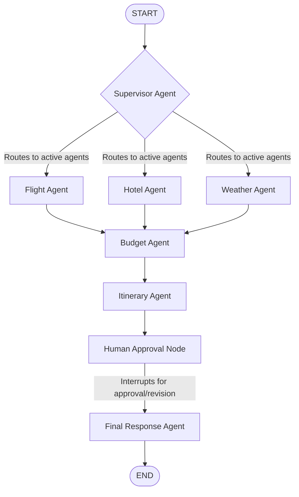

# Stateful Multi-Agent Travel Planner

A production-grade, stateful multi-agent travel assistant that orchestrates specialized LLM agents and API integrations to design personalized travel plans. The project is built using **LangGraph** for cyclic agent coordination, uses the **Model Context Protocol (MCP)** to fetch live flight, weather, and web data, and supports **Human-in-the-Loop (HITL)** approvals with persistent checkpointing.

---

## 🏗️ Architecture

The system utilizes a **Supervisor & Specialist** design pattern modeled as a state graph:



1. **Supervisor Agent**: Parses user travel queries, enforces safety/topic guardrails, extracts constraints (budget, destination, travel dates), and selects which specialist agents to invoke.
2. **Specialists**:
   - **Flight Agent**: Gathers local flight and airline listings via the AviationStack MCP.
   - **Hotel Agent**: Gathers stay options using Tavily Web Search.
   - **Weather Agent**: Gathers real-time forecasts for the destination via the OpenWeather MCP.
   - **Budget Agent**: Analyzes expenses and checks feasibility against constraints.
   - **Itinerary Agent**: Consolidates results into a comprehensive draft itinerary.
3. **Human Approval**: The system pauses execution (`interrupt`) to solicit review from the user via the frontend. The user can approve and finalize the plan or request revisions.
4. **Final Response Agent**: Incorporates human revision feedback or finalizes and outputs the clean travel package.

---

## 🚀 Key Features

* **Advanced Agent Orchestration**: Uses **LangGraph** to govern execution loops, message accumulation, and conditional transitions.
* **Model Context Protocol (MCP) Integration**: Leverages both local `stdio` MCP servers (running python subprocesses for weather and aviation) and hosted HTTP MCP clients (Tavily search).
* **Human-in-the-Loop (HITL)**: Supports runtime interruption and execution resumption based on user inputs.
* **Persistent Checkpointing**: Integrated with **PostgreSQL** (`PostgresSaver`) to save conversational state across restarts and enable multi-user thread memory.
* **Dockerized Infrastructure**: Multi-container Docker Compose setup configuring the Python environment alongside a persistent PostgreSQL database.
* **Modern Streamlit Frontend**: Beautiful interface featuring suggestion chips, expandable planning status logs (`st.status`), and responsive tabbed outputs.

---

## 📂 Project Structure

```
├── aviationstack-mcp/      # Subproject: AviationStack MCP server
│   ├── src/                # MCP source code
│   └── pyproject.toml      # Project configuration & dependencies
├── weather_mcp_server.py   # Local FastMCP weather server
├── agents.py               # Specialist and Supervisor agent LLM calls
├── graph.py                # LangGraph StateGraph composition and logic
├── state.py                # TypedDict defining graph and thread state
├── config.py               # Environment configuration and LLM initialization
├── frontend.py             # Streamlit application UI
├── requirements.txt        # Python package dependencies
├── Dockerfile              # Docker container definition
├── docker-compose.yml      # Orchestrates Python application & Postgres container
├── .dockerignore           # Excludes local environments and assets from Docker build
├── .gitignore              # Excludes local files from Git control
└── .env.example            # Template for environment keys
```

---

## ⚙️ Setup and Installation

### Local Setup

1. **Clone the Repository**:
   ```bash
   git clone https://github.com/your-username/trip-planner-agent.git
   cd trip-planner-agent
   ```

2. **Configure Environment Variables**:
   Copy the example environment template and fill in your API keys:
   ```bash
   cp .env.example .env
   ```
   *Required Keys:* `GROQ_API_KEY`, `TAVILY_API_KEY`, `OPENWEATHER_API_KEY`, `AVIATION_STACK_API_KEY`.

3. **Install Dependencies**:
   Create and activate a virtual environment, then install requirements:
   ```bash
   python -m venv .venv
   # Windows:
   .venv\Scripts\activate
   # macOS/Linux:
   source .venv/bin/activate

   pip install -r requirements.txt
   pip install -e ./aviationstack-mcp
   ```

4. **Ensure PostgreSQL is Running**:
   Ensure you have a local PostgreSQL server running with the database configured in your `.env` connection string (default database: `langgraph_memory`).

5. **Run the Application**:
   ```bash
   streamlit run frontend.py
   ```

---

## 🐳 Running with Docker (Recommended)

To run the entire stack (PostgreSQL database checkpointer + Streamlit frontend) without local installations:

1. **Ensure Docker Desktop is running**.
2. **Build and start the containers**:
   ```bash
   docker compose up --build
   ```
3. Open [http://localhost:8501](http://localhost:8501) in your browser.

*Note: Docker Compose automatically binds the local port `5432` for PostgreSQL and `8501` for Streamlit, mounting container volumes to persist travel logs.*

---

## ☁️ Deployment Guide

This project can be deployed easily to cloud platforms that support Docker containers (such as **Render**, **Railway**, **Google Cloud Run**, or **Hugging Face Spaces**).

### Deploying to Render / Railway
1. Push this repository to your GitHub account.
2. Create a new **Web Service** on Render/Railway.
3. Connect your GitHub repository.
4. Select the environment type as **Docker**.
5. Add the necessary Environment Variables (matching your `.env`) in the provider dashboard settings.
6. Connect a hosted PostgreSQL instance (or create a database service within the provider network) and set the `DATABASE_URL` variable to point to it.
7. Deploy! The provider will build the image from the `Dockerfile` and start the Streamlit service automatically.

### ☸️ Deploying to Kubernetes (Production Grade)

For enterprise-grade orchestration, high-availability, and scalability, you can deploy the app to a Kubernetes cluster (e.g., EKS, GKE, AKS, or local Minikube/kind). 

Manifests are provided in the [`k8s/`](file:///c:/Users/starg/OneDrive/Desktop/Data%20Science/ML%20Projects/Trip%20planner%20and%20booking%20agent/k8s) folder:
* **`secrets.yaml`**: Stores your secure LLM and tool API credentials.
* **`postgres.yaml`**: Standard PostgreSQL `StatefulSet` + persistent volume claim (PVC) and internal database Service.
* **`web.yaml`**: Scalable Streamlit app `Deployment` (configured to run 2 replicas) and external `LoadBalancer` Service.

#### Deployment Steps:

1. **Build and push the Docker image** to a container registry (e.g., Docker Hub, AWS ECR):
   ```bash
   docker build -t your-registry-username/travel-planner-web:latest .
   docker push your-registry-username/travel-registry/travel-planner-web:latest
   ```
   *(Update the image name in `k8s/web.yaml` to match your pushed tag.)*

2. **Configure your Secrets**:
   Update your actual keys in [`k8s/secrets.yaml`](file:///c:/Users/starg/OneDrive/Desktop/Data%20Science/ML%20Projects/Trip%20planner%20and%20booking%20agent/k8s/secrets.yaml) and apply it:
   ```bash
   kubectl apply -f k8s/secrets.yaml
   ```

3. **Deploy PostgreSQL**:
   ```bash
   kubectl apply -f k8s/postgres.yaml
   ```

4. **Deploy the Streamlit App**:
   ```bash
   kubectl apply -f k8s/web.yaml
   ```

5. **Expose and Access**:
   Find the external IP assigned to your application load balancer:
   ```bash
   kubectl get service travel-planner-web-service
   ```

